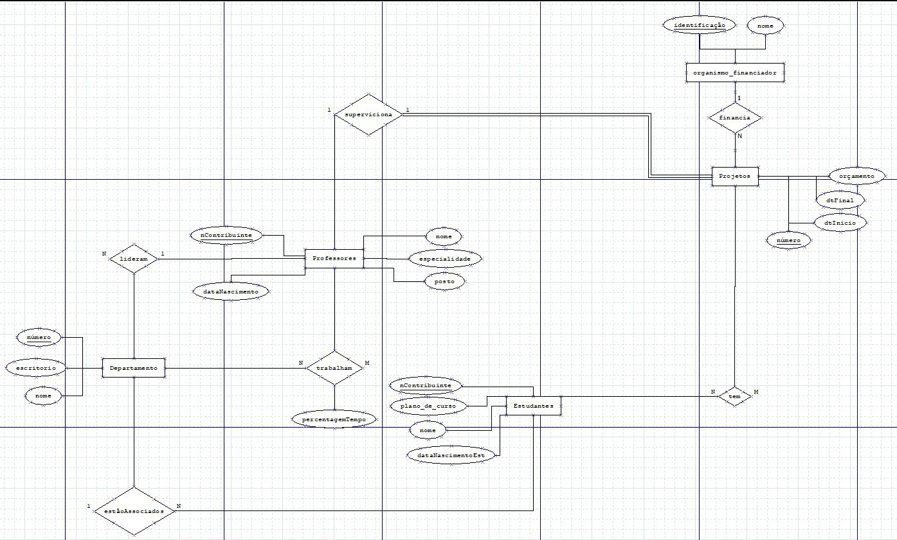

# Momento 2 de avaliação contínua 2022/23

Trabalho para a disciplina de Sistemas de Informação e Bases de Dados na UMAIA desenvolvido pelo Grupo 04

## Descrição Breve do projeto:

Este projeto trata-se de proceder à análise de um problema de informatização de um Sistema de Informação, com especial enfoque no estudo e definição do
modelo de dados a implementar.
Este problema foi criado por nós e deveremos procurar uma maneira de o resolucionar recorrendo à criação de um modelo de dados

## Grupo

André Guimarães - 40091

Gonçalo Dinis - 40927

José Soares - 40080

Marco Bolota - 34851

## Organização do Reportório

Relatórios na pasta designada: [doc folder](Docs/)

Source code is in the [src folder](src/)

## Gallery

|Modelo EA|Normalização|           |
|-----------|-----------|-----------|
|     |    |

## Softwares e Tecnologias:

[VS Code](https://code.visualstudio.com/)

[DiaPortable](https://portableapps.com/apps/office/dia_portable)

## Relatórios:

[Proposta Base de Dados - M2](https://github.com/JoseMSoares/TCM22-SIBD-G04/blob/74567ec05de9463f95cb0663200d56e587aa46fc/Momento%202%20-%20G04/PropostaBaseDados.pdf)

[Relatório de Especificação da Informação](https://github.com/JoseMSoares/TCM22-SIBD-G04/blob/1d8883926bb623f247a3fbeb9f4cb5dd8c30c752/Docs/rei/rei00.md)

